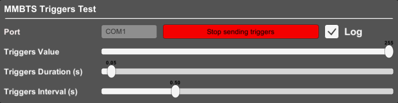

# NeurospecTriggerBox-Unity
This Unity plugin is used to send triggers with the [MMBT-S Trigger Box](https://shop.neurospec.com/mmbt-s-trigger-interface-box) from [Neurospec AG](https://neurospec.com/).  
Many devices require triggers to be sent via a parallel port, but these days many computers (especially laptops) do not have parallel ports anymore.  
This little device basically serves as a USB-to-parallel port adapter.  
After installing the driver that ships with the device, the trigger box will appear as a serial COM port.  

[SerialPort_MMBTS.cs](Scripts/SerialPort_MMBTS.cs) can be used outside of Unity in a typical CSharp project.

## System requirements
Unity ***2017.4.35f1*** and newer versions  
You need to set the Unity ***API Compatibility Level*** to ***.Net 2.0*** in order to get access to ***System.IO.Ports***
